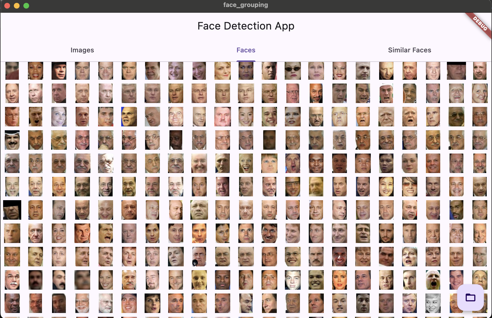
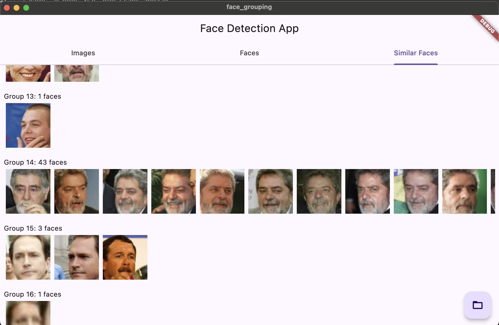

# Face Detection and Grouping App

## Overview

This Face Detection and Grouping App is a powerful tool designed to process images from a directory, detect faces, and group similar faces together. The app is built using Flutter for the frontend and leverages the OpenCV Dart library for face detection and recognition. It uses multiple isolates to efficiently process large sets of images concurrently.

## Features

- **Directory Processing**: Select a directory of images to be processed.
- **Face Detection**: Detects faces in each image using a pre-trained model.
- **Progress Tracking**: Shows real-time progress of image processing and face detection.
- **Face Grouping**: Groups similar faces across different images.
- **Detailed View**: View details of each grouped face, including the original image and bounding box of the detected face.

## Screenshots

### Faces Tab


### Groups Tab


## Installation

### Prerequisites

- Flutter SDK
- Dart
- OpenCV Dart Package

### Steps

1. **Clone the Repository**:
   ```bash
   git clone https://github.com/abdelaziz-mahdy/face_grouping.git
   cd face_grouping
   ```

2. **Install Dependencies**:
   ```bash
   flutter pub get
   ```

3. **Run the App**:
   ```bash
   flutter run
   ```

## Usage

1. **Launching the App**:
   - Run the app on an emulator or a physical device.
   
2. **Selecting a Directory**:
   - Click the folder icon button to open a file picker and select the directory containing the images you want to process.
   
3. **Processing Images**:
   - The app will start processing the selected directory, showing progress and estimated time remaining.
   
4. **Viewing Results**:
   - Navigate through the tabs to view the detected faces and grouped similar faces.
   - Click on a face group to see more details about each face in the group.

## Code Structure

### Main Components

- **Controllers**:
  - `FaceDetectionController`: Manages the state and logic for face detection.
  - `FaceGroupingController`: Manages the state and logic for grouping similar faces.
  - `FaceRecognitionController`: Handles the complete process of face detection followed by face grouping.

- **Models**:
  - `FaceGroup`: Represents a grouped face with its image data and bounding box.
  - `ImageData`: Represents the data of an image including the path and detected face rectangles.
  - `SendableRect`: Represents a face's bounding box with its coordinates and dimensions.

- **Services**:
  - `ImageService`: Handles image processing tasks including loading images and detecting faces.
  - `FaceRecognitionService`: Handles the face recognition and grouping logic using OpenCV.

- **UI**:
  - `HomePage`: Main page with tabs to navigate between different views.
  - `ImagesTab`: Displays the list of processed images and the number of faces detected in each.
  - `FacesTab`: Shows the detected faces in a grid view.
  - `SimilarFacesTab`: Displays the groups of similar faces.
  - `GroupFacesDetailScreen`: Shows details of each face in a selected group.

### Key Classes and Methods

- **Face Detection**:
  - `FaceDetectionController.processDirectory(String directoryPath)`: Processes a directory of images and detects faces.

- **Face Grouping**:
  - `FaceGroupingController.groupFaces()`: Groups similar faces from the detected faces.
  
## Future Improvements

- **Enhance Accuracy**: Improve face detection and recognition accuracy by using more advanced models.
- **UI/UX Enhancements**: Provide a more interactive and user-friendly interface.
- **Cloud Integration**: Enable processing of images stored in the cloud.

## License

This project is licensed under the MIT License - see the [LICENSE](LICENSE) file for details.

## Contributing

Contributions are welcome! Please fork the repository and submit pull requests for any improvements or bug fixes.

---

Feel free to reach out if you have any questions or need further assistance. Happy coding!